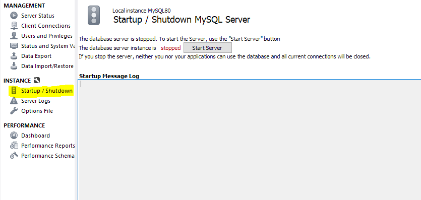
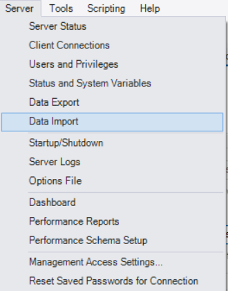
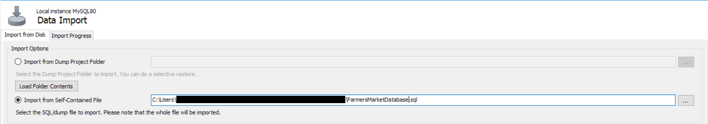

# README

## Installing MySQL Server
Follow the instructions in the [MySQL Getting Started Guide](https://dev.mysql.com/doc/mysql-getting-started/en/#mysql-getting-started-installing) to install MySQL Server.

## Installing MySQL Workbench
Refer to the [MySQL Workbench Installation Guide](https://dev.mysql.com/doc/workbench/en/wb-installing.html) for detailed steps to install MySQL Workbench.

## Starting the Server from within Workbench
1. Go to the "Server" menu and choose "Startup/Shutdown" or select the Startup/Shutdown option in the sidebar under "Instance".
2. Press the "Start Server" button.

    

## Importing the Database
This process assumes you have downloaded the provided database file.

1. Go to the "Server" menu and choose "Data Import".

    
    
2. Choose the downloaded `FarmersMarketDatabase.sql` file from the folder you downloaded it to. The script includes schema creation and will create a schema called `farmers_market`, so you don't need to enter a target schema.

    
    
3. Scroll down and click the "Start Import" button.
4. After the database has restored, you can open a new SQL tab (use the first icon, which is labeled with the word SQL and +) and start writing and running queries.

 
 

*Note: The accompanying figures are from MySQL Workbench 8.0.*